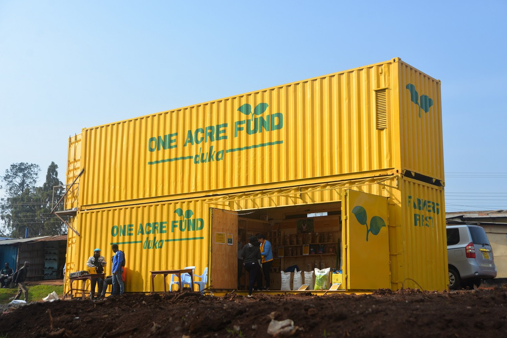

# Portfolio

---
## Professional Projects -- COMING SOON

---
## Beginner Projects
The first projects I took on to develop my data science skills. 

---
#### Web Scraping - [here](https://github.com/bellpatrick/bellpatrick.github.io/blob/main/webscraping/Data%20Scientist%20Job%20Posts%20-%20Web%20Scraping.ipynb)

*Key Competencies: web scraping, EDA, NLP, Natural language Toolkit (NLTK)*

---
#### Prdicting Maize Seed Sales in Kenya - [here](https://github.com/bellpatrick/bellpatrick.github.io/blob/main/maize_sales/maize_acreage.ipynb)

*Key Competencies: data processing, EDA, classification machine learning algorithms, sklearn, model comparison*

---
#### Rural Retail Customer Segmentation in Kenya - [here (https://github.com/bellpatrick/bellpatrick.github.io/blob/main/duka_segmentation/Duka%20Customer%20Segmentation.ipynb)

*Key Competencies: data processing, customer segmentation, K-Means Clustering, unsupervised maching learning *

---

Page template forked from <a href="https://github.com/evanca/quick-portfolio">evanca</a>

<!-- Remove above link if you don't want to attibute -->
